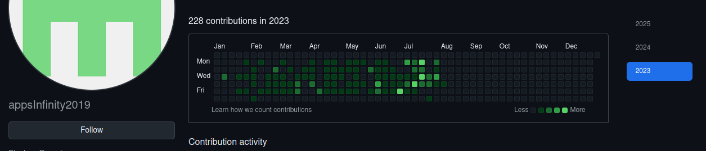

<!--
**AndresCagua/AndresCagua** is a ✨ _special_ ✨ repository because its `README.md` (this file) appears on your GitHub profile.

## Andrés Cagua ⚡

Here are some ideas to get you started:

- 🔭 I’m currently working on ...
- 🌱 I’m currently learning ...
- 👯 I’m looking to collaborate on ...
- 🤔 I’m looking for help with ...
- 💬 Ask me about ...
- 📫 How to reach me: ...
- 😄 Pronouns: ...
- ⚡ Fun fact: ...
-->

# Andrés Cagua

## 👨‍💻 Desarrollador DWH | Analista de Datos

📌 **Ubicación:** Cuenca, Ecuador  
📞 **Teléfono:** +593 983105699  
📧 **Correo:** [andrescagua-88@hotmail.com](mailto:andrescagua-88@hotmail.com)  
👤 **LinkedIn:** [linkedin.com/in/jacch](https://www.linkedin.com/in/jacch/)

---

### :zap: Actividad reciente
<!--RECENT_ACTIVITY:start-->
<!--RECENT_ACTIVITY:end-->
<!--RECENT_ACTIVITY:last_update-->
Last Updated: Monday, July 14th, 2025, 6:49:35 AM
<!--RECENT_ACTIVITY:last_update_end-->

---

### :zap: Mis últimos videos
<!-- YOUTUBE:START -->
- [logging.sh: Logging estructurado y multinivel para Bash inspirado en Python](https://www.youtube.com/watch?v=BCcEeg3PoLw)
- [Migración Automática de PostgreSQL a Netezza con Python | ETL Robusto, Validado y Auditable](https://www.youtube.com/watch?v=67fV1e45WqM)
- [Configuración NeoVim v0.10.0](https://www.youtube.com/watch?v=Cn_QsInEvHo)
- [Apache Hive: Creación de Tablas, Carga de Datos y Particionado &lpar;Con Bash Script&rpar;](https://www.youtube.com/watch?v=LfDrM8bTyFI)
- [📌 &quot;Instalación de Hadoop y Hive en AlmaLinux 8 + Creación de BD, Tabla y Carga de Datos 🚀&quot;](https://www.youtube.com/watch?v=tQQX3mZkDDI)
<!-- YOUTUBE:END -->

---

## 💭 Sobre mí

Desarrollador con dos años de experiencia en tecnologías como WordPress, Angular, SpringBoot, MySQL, OracleSQL y PostgreSQL. Actualmente me desempeño como Desarrollador DWH, donde he fortalecido habilidades en análisis de datos, Shell Scripts y PL/SQL.

Apasionado por el backend, las bases de datos y el análisis de datos, con un fuerte enfoque en la resolución de problemas complejos y la generación de soluciones innovadoras.

---

## 💼 Experiencia Laboral

### 👨‍💻 Desarrollador DWH  
**Viamatica**  
*Septiembre 2023 - Presente*
- 🔹 Desarrollo de procesos y funciones en PL/SQL para bases de datos Oracle.
- 🔹 Creación de scripts Bash para comunicación y procedimientos en Oracle.

### 👨‍💻 Desarrollador Junior  
**Inapps**  
*Enero 2023 - Agosto 2023*
- 🔹 Mantenimiento y actualización de una tienda virtual desarrollada en WordPress.
- 🔹 Desarrollo de una aplicación web para gestión de restaurantes (Frontend en Angular y Backend en SpringBoot).

---

## 🎓 Formación Académica

**Ingeniería Electrónica**  
Universidad Politécnica Salesiana

---

## 🔧 Habilidades

- ✨ **SQL** / **PLSQL**
- ✨ **Shell Scripts Linux**
- ✨ **JavaScript**
- ✨ **Python**
- ✨ **Angular**
- ✨ **Java**
- ✨ **Bases de Datos** (MySQL, OracleSQL, PostgreSQL)
- ✨ **DWH / Big Data**
- ✨ **Análisis de Datos**

---

## 🛠️ Tecnologías y Herramientas

---

> "Al buscar lo imposible el hombre siempre ha realizado y reconocido lo posible. Y aquellos que sabiamente se han limitado a lo que creían posible, jamás han dado un solo paso adelante."  
> — **Mijail Bakunin**

